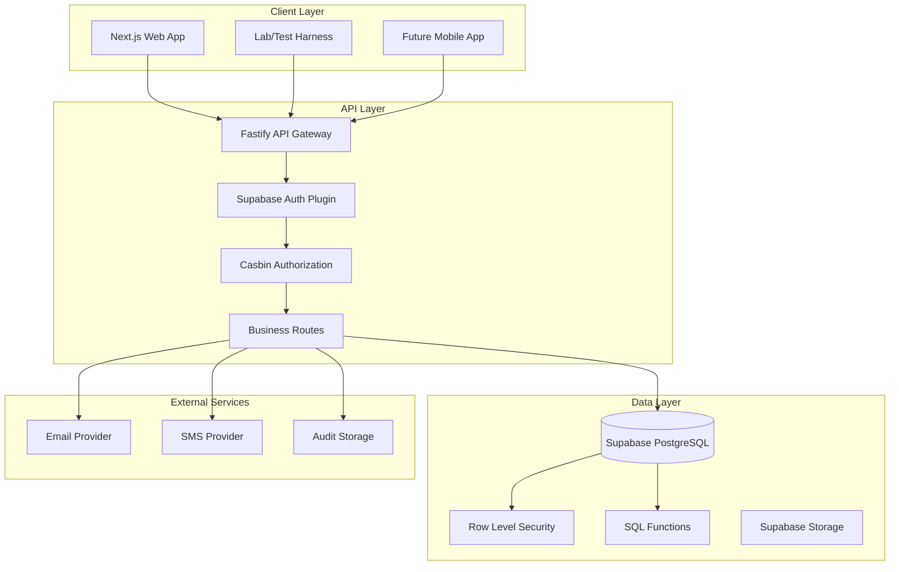
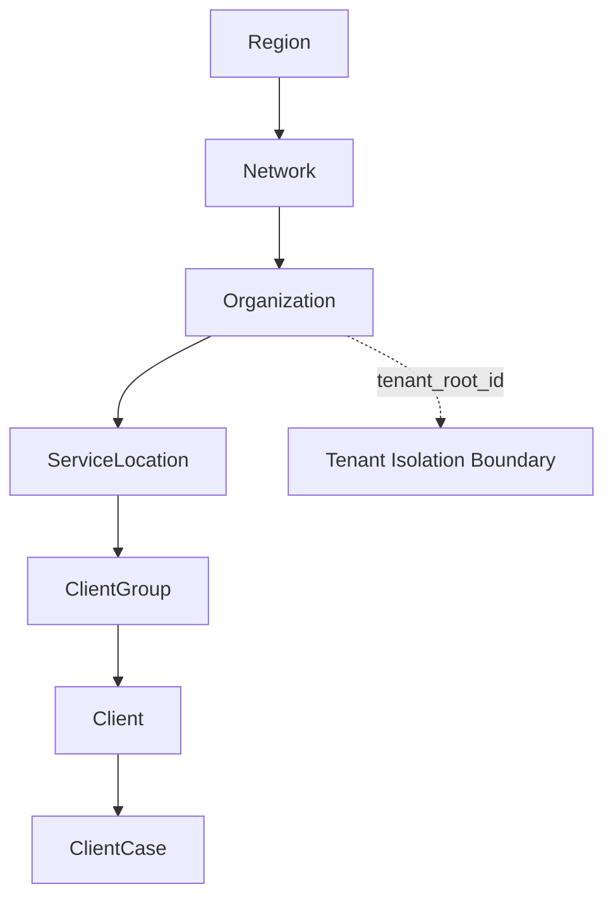
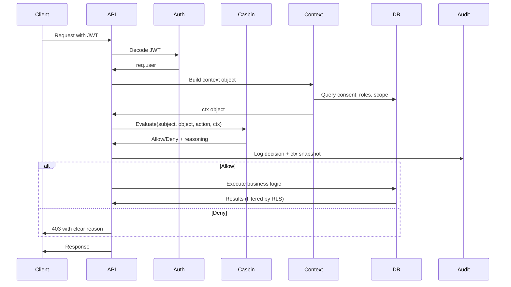

# Design Document

## Overview

The Behavioral Health Coordination Platform is a multi-tenant SaaS solution built on a modern TypeScript stack with Supabase/PostgreSQL. The architecture emphasizes security-first design with hybrid RBAC/PBAC authorization, comprehensive PHI/PII protection, and a hierarchical tenancy model. The platform supports both healthcare providers and community helpers while maintaining strict privacy boundaries through advanced consent management and audit logging.

### Key Design Principles

- **Security by Default**: Deny-by-default authorization with defense-in-depth through RLS
- **Privacy First**: PHI/PII redaction by default with explicit consent gates
- **Multi-Tenant Isolation**: Hierarchical tenancy with `tenant_root_id = org_id`
- **Audit Everything**: Comprehensive logging of all authorization decisions and data access
- **Developer Experience**: Rich Lab/Test Harness for verification and development

## Architecture

### System Architecture



### Tenancy Model



### Authorization Flow



## Components and Interfaces

### Core API Components

#### 1. Authentication Plugin (`/apps/api/src/plugins/auth.ts`)
```typescript
interface AuthPlugin {
  // Decode Supabase JWT and populate req.user
  decodeJWT(token: string): Promise<User>
  // Validate token and extract claims
  validateToken(req: FastifyRequest): Promise<void>
}

interface User {
  id: string
  email: string
  role?: string
  app_metadata?: Record<string, any>
}
```

#### 2. Authorization Middleware (`/apps/api/src/middleware/authorize.ts`)
```typescript
interface AuthorizationContext {
  purpose?: 'care' | 'billing' | 'QA' | 'oversight' | 'research'
  legal_basis?: boolean
  dataset?: { deidentified: boolean }
  identified_ok?: boolean
  org_scope?: boolean          // request is confined to caller's org
  same_org?: boolean
  same_location?: boolean
  in_network?: boolean
  delegated_fields?: string[]
  field?: string

  service?: { claimed: boolean }
  assigned_to_user?: boolean
  shares_program?: boolean
  program_access_level?: 'view' | 'write' | 'full' | null

  consent_ok?: boolean
  consent_id?: string | null
  contains_phi?: boolean

  self_scope?: boolean
  affiliated?: boolean

  temp_grant?: boolean
  two_person_rule?: boolean

  bg?: boolean                 // break-glass active
  bg_expires_at?: string | null  // ISO timestamp
}

interface AuthorizationMiddleware {
  authorize(
    subject: { role: string },
    object: { type: string, id: string },
    action: string,
    contextBuilder: (req: FastifyRequest) => Promise<AuthorizationContext>
  ): FastifyMiddleware
}
```

#### 3. Context Builders (`/apps/api/src/context/`)
```typescript
interface ContextBuilder {
  buildClientContext(req: FastifyRequest, clientId: string): Promise<AuthorizationContext>
  buildNoteContext(req: FastifyRequest, noteId: string): Promise<AuthorizationContext>
  buildReferralContext(req: FastifyRequest, referralId: string): Promise<AuthorizationContext>
  buildReportContext(req: FastifyRequest, reportType: string): Promise<AuthorizationContext>
}
```

### Database Schema Design

#### Core Tables Structure
```sql
-- Identity & Tenancy
app.users_profile (id, auth_user_id, email, display_name, is_helper)
app.regions (id, name, jurisdiction, attributes)
app.networks (id, region_id, name, attributes)
app.organizations (id, region_id, name, tenant_root_id) -- tenant_root_id = id
app.service_locations (id, org_id, name, claimed, claim_owner_user_id)

-- Authorization
app.roles (id, name, scope_type, description, baseline_permissions)
app.role_assignments (id, user_id, role_id, scope_type, scope_id, expires_at)

-- Clients & Cases (Cross-Org Identity)
app.clients (id, tenant_root_id, owner_org_id, pii_ref, fingerprint)
app.client_cases (id, client_id, location_id, status, program_ids, assigned_user_ids)

-- Cross-Org Client Linking
app.client_links (id, client_id, from_org_id, to_org_id, consent_id, reason, linked_by, linked_at, unlinked_at)

-- Normalized Consent Management
app.client_consents (id, client_id, scope_type, scope_id, allowed_purposes, method, evidence_uri, granted_by, granted_at, expires_at, revoked_at, revoked_by, grace_period_minutes)

-- Content
app.notes (id, subject_type, subject_id, author_user_id, classification, contains_phi, is_helper_journal)
app.referrals (id, from_user_id, to_location_id, client_id, visibility_scope, status)

-- Availability with Concurrency Control
app.availability (id, location_id, type, attributes, total, available, version, updated_by, updated_at)

-- Audit & Compliance with Hash Chain
app.audit_logs (id, ts, actor_user_id, action, resource_type, resource_id, decision, ctx, policy_version, row_hash)
app.temporary_grants (id, user_id, resource_selector, verbs, expires_at)
```

#### RLS Policy Design
```sql
-- Tenant Isolation (Defense in Depth)
CREATE POLICY clients_tenant_select ON app.clients
  FOR SELECT USING (
    EXISTS (
      SELECT 1 FROM app.role_assignments ra
      JOIN app.organizations o ON o.id = ra.scope_id AND ra.scope_type='org'
      WHERE ra.user_id = app.current_profile_id()
        AND clients.tenant_root_id = o.id
    )
  );

-- Membership-Based Access
CREATE POLICY orgs_member_select ON app.organizations
  FOR SELECT USING (
    EXISTS (
      SELECT 1 FROM app.role_assignments ra
      WHERE ra.user_id = app.current_profile_id()
        AND ra.scope_type = 'org'
        AND ra.scope_id = organizations.id
    )
  );
```

### Lab/Test Harness Components

#### 1. Persona Management
```typescript
interface PersonaService {
  listPersonas(): Promise<Persona[]>
  impersonate(personaId: string): Promise<void>
  getCurrentPersona(): Promise<Persona | null>
}

interface Persona {
  id: string
  name: string
  email: string
  roles: RoleAssignment[]
  organizations: Organization[]
}
```

#### 2. Policy Simulator
```typescript
interface PolicySimulator {
  simulate(
    role: string,
    objectType: string,
    action: string,
    context: AuthorizationContext
  ): Promise<PolicyResult>
  
  reloadPolicies(): Promise<void>
}

interface PolicyResult {
  decision: 'allow' | 'deny'
  matchedPolicy?: string
  reasoning: string
  contextSnapshot: AuthorizationContext
}
```

#### 3. RLS Tester
```typescript
interface RLSTester {
  executeQuery(
    table: string,
    filters: Record<string, any>,
    userJWT: string
  ): Promise<QueryResult>
  
  listWhitelistedTables(): string[]
}
```

### Frontend Architecture

#### Next.js App Structure
```
/apps/web/
├── app/
│   ├── (public)/          # Public routes (no auth)
│   │   ├── registry/      # Service registry search
│   │   └── claim/         # Service claiming
│   ├── (authenticated)/   # Protected routes
│   │   ├── dashboard/     # Main dashboard
│   │   ├── clients/       # Client management
│   │   ├── cases/         # Case management
│   │   ├── referrals/     # Referral workflows
│   │   └── reports/       # Analytics & reporting
│   └── lab/               # Development Lab
│       ├── personas/      # User impersonation
│       ├── scope/         # Context switching
│       ├── capabilities/  # Permission testing
│       ├── context/       # Context controls
│       ├── policies/      # Policy simulation
│       ├── rls/           # RLS testing
│       ├── seeder/        # Data generation
│       ├── registry/      # Service search
│       ├── referrals/     # Referral testing
│       └── notifications/ # Notification testing
├── components/
│   ├── ui/                # shadcn/ui components
│   ├── forms/             # Form components
│   ├── tables/            # Data tables
│   └── lab/               # Lab-specific components
└── lib/
    ├── api.ts             # API client
    ├── auth.ts            # Authentication
    └── types.ts           # TypeScript types
```

## Data Models

### Client Identity & Cross-Org Linking

```typescript
interface Client {
  id: string
  tenant_root_id: string  // Owning organization
  owner_org_id: string
  primary_location_id?: string
  pii_ref: {
    first_name?: string
    last_name?: string
    dob?: string
    ssn_last4?: string
  }
  flags: {
    high_risk?: boolean
    requires_interpreter?: boolean
    preferred_language?: string
  }
  fingerprint: string  // Privacy-preserving hash: sha256(lower(ascii(name))+dob_iso+region_salt)
  created_at: Date
}

interface ClientLink {
  id: string
  client_id: string
  from_org_id: string
  to_org_id: string
  consent_id?: string
  reason: string
  linked_by: string
  linked_at: Date
  unlinked_at?: Date
}

interface ClientConsent {
  id: string
  client_id: string
  scope_type: 'platform' | 'organization' | 'location' | 'helper' | 'company'
  scope_id?: string
  allowed_purposes: ('care' | 'billing' | 'QA' | 'oversight' | 'research')[]
  method: 'verbal' | 'signature'
  evidence_uri?: string
  granted_by: string
  granted_at: Date
  expires_at?: Date
  revoked_at?: Date
  revoked_by?: string
  grace_period_minutes: number
}
```

### Authorization Models

```typescript
interface RoleAssignment {
  id: string
  user_id: string
  role_id: string
  scope_type: 'region' | 'network' | 'org' | 'location' | 'global'
  scope_id: string
  source?: 'invitation' | 'self_registration' | 'admin_assignment'
  expires_at?: Date
  metadata: Record<string, any>
  created_at: Date
}

interface Role {
  id: string
  name: string
  scope_type: string
  description: string
  baseline_permissions: {
    read?: string[]
    write?: string[]
    delete?: string[]
  }
}
```

### Service Registry & Availability

```typescript
interface ServiceProfile {
  location_id: string
  taxonomy_code?: string
  populations: string[]  // ['adults', 'adolescents', 'families']
  eligibility: {
    age_min?: number
    age_max?: number
    gender?: string[]
    insurance?: string[]
    conditions?: string[]
  }
  hours: {
    monday?: { open: string, close: string }
    tuesday?: { open: string, close: string }
    // ... other days
  }
  search_vector: string  // PostgreSQL tsvector for FTS
}

interface Availability {
  id: string
  location_id: string
  type: 'beds' | 'slots' | 'appointments'
  attributes: {
    // Boolean attributes
    female?: boolean
    pregnant?: boolean
    substance_use?: boolean
    mental_health?: boolean
    // Range attributes
    min_age?: number
    max_age?: number
    // ... other matching attributes
  }
  total: number
  available: number
  version: number  // For optimistic concurrency control
  updated_by: string
  updated_at: Date
}

// Predicate mapping examples:
// { "female": true, "pregnant": true } → attributes @> '{"female":true,"pregnant":true}'
// { "max_age": {"$lte": 17} } → (attributes->>'max_age')::int <= 17
```

## Error Handling

### Standardized Error Response

```typescript
interface APIError {
  code: string
  message: string
  reason: string
  hint?: string
  correlationId: string
  details?: Record<string, any>
}

// Example error responses
const CONSENT_REQUIRED: APIError = {
  code: 'CONSENT_REQUIRED',
  message: 'Access denied: client consent required',
  reason: 'Client has not provided consent for this purpose of use',
  hint: 'Obtain consent for purpose: care',
  correlationId: 'req_123456'
}

const INSUFFICIENT_PERMISSIONS: APIError = {
  code: 'INSUFFICIENT_PERMISSIONS',
  message: 'Access denied: insufficient permissions',
  reason: 'User role CaseManager cannot perform action update on resource type Client',
  hint: 'Contact your administrator for elevated permissions',
  correlationId: 'req_123457'
}
```

### Authorization Error Handling

```typescript
interface AuthorizationError extends Error {
  code: 'AUTHORIZATION_FAILED'
  decision: 'deny'
  subject: { role: string }
  object: { type: string, id: string }
  action: string
  context: AuthorizationContext
  matchedPolicy?: string
  reasoning: string
}
```

## Testing Strategy

### Policy Testing Framework

```typescript
interface PolicyTest {
  name: string
  persona: string  // Role name
  scenario: {
    object: { type: string, id: string }
    action: string
    context: Partial<AuthorizationContext>
  }
  expected: 'allow' | 'deny'
  reason?: string
}

// Example policy tests
const POLICY_TESTS: PolicyTest[] = [
  {
    name: 'CaseManager can read assigned client with consent',
    persona: 'CaseManager',
    scenario: {
      object: { type: 'Client', id: 'client_123' },
      action: 'read',
      context: {
        assigned_to_user: true,
        consent_ok: true,
        purpose: 'care'
      }
    },
    expected: 'allow'
  },
  {
    name: 'HelperBasic cannot read PHI without consent',
    persona: 'HelperBasic',
    scenario: {
      object: { type: 'Client', id: 'client_123' },
      action: 'read',
      context: {
        contains_phi: true,
        consent_ok: false
      }
    },
    expected: 'deny',
    reason: 'PHI access requires valid consent'
  }
]
```

### RLS Testing

```typescript
interface RLSTest {
  name: string
  table: string
  persona: string
  expectedRowCount: number | 'any'
  filters?: Record<string, any>
}

const RLS_TESTS: RLSTest[] = [
  {
    name: 'Non-member sees 0 clients',
    table: 'app.clients',
    persona: 'BasicAccount',
    expectedRowCount: 0
  },
  {
    name: 'OrgAdmin sees only tenant clients',
    table: 'app.clients',
    persona: 'OrgAdmin',
    expectedRowCount: 'any',
    filters: { tenant_root_id: 'org_123' }
  }
]
```

### Integration Testing

```typescript
interface EndpointTest {
  name: string
  method: 'GET' | 'POST' | 'PUT' | 'DELETE'
  path: string
  persona: string
  headers?: Record<string, string>
  body?: any
  expectedStatus: number
  expectedResponse?: any
}

const ENDPOINT_TESTS: EndpointTest[] = [
  {
    name: 'GET /me/capabilities returns member status',
    method: 'GET',
    path: '/me/capabilities?scopeType=org&scopeId=org_123',
    persona: 'CaseManager',
    expectedStatus: 200,
    expectedResponse: { member: true }
  },
  {
    name: 'POST /clients requires consent for PHI',
    method: 'POST',
    path: '/clients',
    persona: 'CaseManager',
    body: { pii_ref: { first_name: 'John' } },
    expectedStatus: 403,
    expectedResponse: { code: 'CONSENT_REQUIRED' }
  }
]
```

## RLS Write Strategy (Security Definer RPC)

### Design Decision
Keep table DML deny-by-default. Perform INSERT/UPDATE/DELETE via **SECURITY DEFINER** RPCs that re-apply policy checks.

### Pattern
- Expose `app.rpc_*` functions for each write path (e.g., `rpc_upsert_availability`, `rpc_create_note`)
- Inside the function, resolve subject roles, build `ctx`, run the same authorization checks as the service layer
- Then perform DML with proper tenant isolation

### Example Implementation
```sql
-- SECURITY DEFINER requires owner to be a role with necessary rights
create or replace function app.rpc_upsert_availability(
  p_location uuid, 
  p_type text, 
  p_attrs jsonb, 
  p_total int, 
  p_available int, 
  p_version bigint
) returns void
language plpgsql security definer as $
declare
  current_version bigint;
begin
  -- Optimistic concurrency control
  select version into current_version from app.availability
   where location_id=p_location and type=p_type and attributes @> p_attrs
   limit 1 for update;

  if current_version is not null and current_version <> p_version then
    raise exception 'version_conflict' using errcode = '40001';
  end if;

  -- Apply authorization checks here (role & ctx validation)
  -- Then perform upsert with incremented version
  -- Log audit entry
end;
$;
```

## Consent Evaluation Engine

### Consent Evaluator Logic
```typescript
interface ConsentEvaluator {
  evaluateConsent(
    clientId: string,
    scopeType: 'platform' | 'organization' | 'location' | 'helper' | 'company',
    scopeId: string,
    purpose: string
  ): Promise<ConsentResult>
}

interface ConsentResult {
  consent_ok: boolean
  consent_id?: string
  reason: string
  grace_period_active?: boolean
}
```

### Evaluation Rules
1. **Hierarchical Consent**: Platform consent AND (org OR location OR helper/company as applicable)
2. **Purpose Validation**: Check `allowed_purposes` array contains requested purpose
3. **Expiration Check**: Consider `expires_at` and `grace_period_minutes`
4. **Future-Only Revocation**: Historical records remain accessible to originating org where legally required
5. **Audit Everything**: Log all consent evaluations with full context

## Policy Governance & Change Management

### Policy Versioning Strategy
- Policies are **versioned artifacts** managed through code review process
- Development/staging environments allow hot reload for testing
- Production deployments use versioned policy bundles
- Only **Super Admin** roles can publish policy bundles to production

### Policy Simulator
```typescript
interface PolicySimulator {
  dryRun(
    role: string,
    objectType: string,
    action: string,
    context: AuthorizationContext,
    policyVersion?: string
  ): Promise<SimulationResult>
}

interface SimulationResult {
  decision: 'allow' | 'deny'
  matchedPolicy: string
  reasoning: string
  policyVersion: string
  contextSnapshot: AuthorizationContext
}
```

### Change Management Process
1. **Development**: Policy changes in feature branches with unit tests
2. **Code Review**: All policy changes require peer review
3. **Staging Validation**: Test policy changes against realistic data
4. **Production Deployment**: Versioned bundle deployment with rollback capability
5. **Audit Trail**: All policy changes logged with actor, timestamp, and changelog

## JWT & Header Conventions

### Custom JWT Claims
```typescript
interface CustomClaims {
  active_org_id?: string      // Currently selected organization
  active_location_id?: string // Currently selected location
  purpose?: string           // Purpose of use for this session
  bg_exp?: number           // Break-glass expiration timestamp
}
```

### Required Headers for PHI Routes
- `X-Purpose-Of-Use`: Required header for all PHI-accessing endpoints
- `X-Idempotency-Key`: Required for all mutating operations
- `If-Match`: Required for availability updates (optimistic concurrency)

### Validation Rules
- Server validates and derives purpose; clients cannot force authorization
- Break-glass TTL enforced server-side regardless of client claims
- Missing purpose-of-use headers result in 400 Bad Request for PHI routes

## Notification System & PHI Handling

### PHI Protection in Notifications
```typescript
interface NotificationChannel {
  type: 'in-app' | 'email' | 'sms'
  phiAllowed: boolean
  contentStrategy: 'full' | 'redacted' | 'link-only'
}

const NOTIFICATION_CHANNELS: NotificationChannel[] = [
  { type: 'in-app', phiAllowed: true, contentStrategy: 'full' },
  { type: 'email', phiAllowed: false, contentStrategy: 'link-only' },
  { type: 'sms', phiAllowed: false, contentStrategy: 'link-only' }
]
```

### Content Strategy
- **In-App**: Full content stored in `notifications` table with PHI protection via RLS
- **Email/SMS**: Only redacted summaries with links to in-app content
- **Development Mode**: Log all notification content instead of external delivery

## Performance Considerations

### Database Optimization

1. **Tenant Isolation Performance**
   - Primary indexes on `tenant_root_id` for all tenant-scoped tables
   - Composite indexes: `(tenant_root_id, created_at)` for time-based queries
   - Specific indexes: `(location_id, type)` on availability table
   - Partition large tables by `tenant_root_id` if needed

2. **Authorization Query Optimization**
   - Materialized views for complex role resolution
   - Cached context building for frequently accessed resources
   - Efficient RLS policies that filter early

3. **Search Performance**
   - GIN indexes on JSONB columns for attribute filtering
   - Full-text search indexes on service profiles
   - Materialized views for availability aggregations
   - Trigram indexes on name fields for fuzzy matching: `CREATE EXTENSION pg_trgm`
   - PostGIS indexes on `service_locations.geom` for distance queries

4. **Cross-Org Linking Performance**
   - Index on `client_links(client_id)` for link history queries
   - Index on `client_consents(client_id)` for consent lookups
   - Composite index on `clients(fingerprint, tenant_root_id)` for duplicate detection

### Caching Strategy

```typescript
interface CacheStrategy {
  // User capabilities (5 minute TTL)
  userCapabilities: Cache<string, Capabilities>
  
  // Policy decisions (1 minute TTL, context-sensitive)
  policyDecisions: Cache<string, PolicyResult>
  
  // Service availability (30 second TTL)
  serviceAvailability: Cache<string, Availability[]>
  
  // Consent status (no cache - always fresh)
  consentStatus: never
}
```

## API Safety Rails

### Idempotency & Concurrency
- All mutating endpoints support `Idempotency-Key` header
- Availability updates require `If-Match` header with version for optimistic concurrency
- Return `409 Conflict` on version mismatches with current version in response

### Pagination & Rate Limiting
- All list endpoints use **cursor pagination** with configurable max page size
- Rate limits applied per IP and per user on search and availability mutation endpoints
- Search endpoints have additional throttling to prevent abuse

### Caching & ETags
- Safe read endpoints (non-PHI) support `ETag/If-None-Match` for caching
- PHI-containing responses never include caching headers
- Cache-Control headers set appropriately based on content sensitivity

### Error Handling
- Standardized error schema with `code`, `message`, `reason`, `hint`, `correlationId`
- PHI routes require `X-Purpose-Of-Use` header or return 400 Bad Request
- Clear error messages for consent failures with remediation guidance

## De-Identified Reporting Rules

### Statistical Disclosure Controls
- Enforce **small-cell suppression** with configurable threshold (default k≥11)
- Apply value rounding for continuous variables in aggregate reports
- Suppress geographic identifiers below certain population thresholds

### Export Controls
- Identified data exports require valid `purpose-of-use`, consent validation, and role authorization
- All exports capture policy version and context snapshot in audit logs
- Export jobs include data lineage and retention metadata

### Reporting Views
- Materialized views include `suppressed` flag for small-cell handling
- Aggregate "<k" buckets into "Other" categories
- Regional/Network reports default to de-identified; identified requires explicit authorization

## Security Considerations

### Data Protection

1. **Encryption at Rest**: All PHI/PII encrypted in database
2. **Encryption in Transit**: TLS 1.3 for all API communications
3. **Key Management**: Supabase managed encryption keys
4. **Backup Security**: Encrypted backups with separate key management

### Access Controls

1. **Principle of Least Privilege**: Minimal permissions by default
2. **Defense in Depth**: API authorization + RLS + SECURITY DEFINER RPCs
3. **Audit Everything**: Comprehensive logging of all data access with hash chain integrity
4. **Break-Glass Controls**: Read-only by default, time-limited emergency access with full audit

### Privacy Protection

1. **Data Minimization**: Only collect necessary PHI/PII
2. **Purpose Limitation**: Enforce purpose-of-use for all PHI access
3. **Consent Management**: Layered, granular, revocable consent controls
4. **De-identification**: Statistical disclosure controls with small-cell suppression
5. **Helper Data Fences**: Strict separation between helper journals and provider case notes

### Audit Immutability & Forensics

1. **Hash Chain Integrity**: Each audit log entry includes hash of previous entry + current data
2. **Tamper Evidence**: Periodic export to WORM storage for compliance
3. **Policy Version Tracking**: All decisions include policy version used
4. **Context Preservation**: Full authorization context snapshot in every audit entry
5. **Forensic Queries**: Ability to reconstruct user access timeline and policy state at decision time

## Deployment Architecture

### Environment Strategy

```yaml
# Development
- Database: Local Supabase or shared dev instance
- API: Local Fastify with hot reload
- Web: Next.js dev server
- Lab: Full feature set enabled

# Staging
- Database: Supabase staging project
- API: Containerized deployment
- Web: Vercel preview deployment
- Lab: Limited to authorized users

# Production
- Database: Supabase production with backups
- API: Multi-region deployment with load balancing
- Web: CDN-backed static deployment
- Lab: Disabled or admin-only access
```

### Monitoring & Observability

```typescript
interface MonitoringStack {
  // Application Performance
  apm: 'DataDog' | 'New Relic'
  
  // Error Tracking
  errors: 'Sentry'
  
  // Audit & Compliance
  auditLogs: 'Supabase + External WORM Storage'
  
  // Security Monitoring
  security: 'Custom dashboards + alerts'
  
  // Business Metrics
  analytics: 'Custom reporting + external BI'
}
```

This design provides a comprehensive foundation for building the behavioral health coordination platform with strong security, privacy, and developer experience considerations.